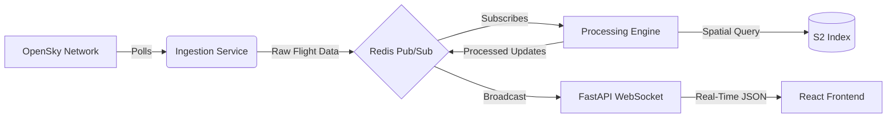

# ⚡️ PROJECT ZEUS

> **Real-Time Airspace Surveillance & Geofencing Engine**


---

## 📡 Overview

**Zeus** is a high-performance, defense-grade airspace monitoring system designed to track thousands of aircraft in real-time. Inspired by advanced defense surveillance platforms, Zeus provides a "single pane of glass" view of the skies, instantly detecting geofence violations and identifying potential threats.

Built with a modern event-driven architecture, it processes live ADS-B data from the OpenSky Network, performs sub-millisecond spatial queries using **Google's S2 Geometry**, and streams updates to a WebGL-accelerated frontend.

---

## 🚀 Key Features

*   **🌐 Real-Time Global Tracking**: Ingests high-frequency state vectors for 5,000+ simultaneous aircraft.
*   **🛡 Advanced Geofencing**: Utilizes **S2 Spatial Indexing** to detect airspace violations with point-in-polygon precision.
*   **⚡️ Event-Driven Pipeline**: Low-latency data flow via **Redis Pub/Sub** and **WebSockets**.
*   **🗺 WebGL Visualization**: **Deck.gl** & **Mapbox** integration for rendering massive datasets with 60FPS fluid animations.
*   **🚨 Critical Alerts**: Instant visual and log-based notification system for "No-Fly Zone" incursions.
*   **🌑 Defense Aesthetic**: Custom dark-mode UI with HUD elements for situational awareness.

---

## 🛠 Tech Stack

### Backend (The Core)
*   **Python 3.11**: High-performance async runtime.
*   **FastAPI**: Modern, fast (high-performance) web framework for building APIs.
*   **Redis**: In-memory data structure store used as a message broker.
*   **S2Sphere**: Python implementation of the S2 Geometry Library for spatial indexing.
*   **Aiohttp**: Asynchronous HTTP client/server.

### Frontend (The Mission Control)
*   **React + Vite**: Blazing fast frontend tooling.
*   **Deck.gl**: Large-scale WebGL-powered data visualization.
*   **Mapbox GL JS**: Interactive, customizable vector maps.
*   **Tailwind CSS**: Utility-first CSS framework for rapid UI development.
*   **Lucide React**: Beautiful & consistent icons.

---

## 📸 Architecture



---

## 💻 Getting Started

### Prerequisites
*   **Docker & Docker Compose**
*   **Node.js 18+** (for local frontend dev)
*   **Mapbox Public Token** (Get one for free at [mapbox.com](https://mapbox.com))

### 1. Clone & Configure
```bash
git clone https://github.com/yourusername/zeus.git
cd zeus

# Add your Mapbox Token
echo "VITE_MAPBOX_TOKEN=pk.your_token_here" > frontend/.env
```

### 2. Launch Backend
Start the ingestion service, processing engine, and Redis broker.
```bash
docker-compose up backend
```

### 3. Launch Mission Control (Frontend)
```bash
cd frontend
npm install
npm run dev
```

Visit **`http://localhost:5173`** to access the dashboard.

---

## 🛡 License

This project is open-source and available under the [MIT License](LICENSE).

---

> *Built with ☕️ and 💻 by Edwin Kim.*
